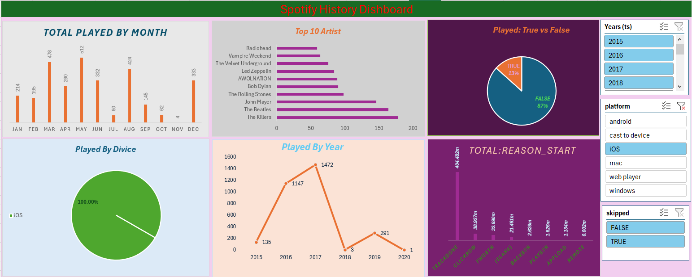

# 🎵 Spotify History Dashboard

## 📌 Project Overview
This project features a **Spotify listening history analysis dashboard** built using **Microsoft Excel**.  
It provides a visual breakdown of your listening habits over time, including top artists, devices used, yearly trends, and playback patterns.  
The dashboard is interactive, allowing filtering by **year**, **platform**, and **skipped status** to uncover deep insights.

---

## 🎯 Key Objectives
- Track **total plays by month** and identify peak listening periods.
- Highlight the **top 10 most played artists**.
- Compare listening activity by **year** and **device**.
- Examine playback start reasons and skipped track patterns.

---

## 🛠 Tools & Techniques
- **Microsoft Excel**
  - Pivot Tables & Pivot Charts
  - Slicers for filtering (Year, Platform, Skipped)
  - Conditional formatting for better readability
  - Chart customization for professional presentation

---

## 📊 Dashboard Highlights
- **Total Played by Month** – Identifies high-activity months (e.g., May with 512 plays).
- **Top 10 Artists** – Includes The Beatles, The Killers, John Mayer, and more.
- **Played: True vs False** – Shows percentage of played tracks.
- **Played by Device** – 100% of plays were from iOS.
- **Played by Year** – Peak year in 2017 with 1,472 plays.
- **Reason for Playback Start** – Breakdown of triggers like `TRACKDONE`, `CLICKROW`, `FWDBTN`, etc.

---

## 📸 Dashboard Preview


---

## 📂 Repository Structure
Spotify_History_Dashboard/
│-- Spotify_History.xlsx # Excel dashboard file
│-- dashboard.png # Dashboard image
│-- README.md # Project documentation

---

## 🚀 How to Use
1. Clone the repository:
   ```bash
https://github.com/Ritesh7370/Spotifty_History_Dishboard


Open the .xlsx file in Microsoft Excel.

Use slicers to filter data by year, platform, or skipped status.

Explore the dashboard to identify trends in your listening habits.

📈 Key Insights
The Beatles and The Killers dominate playback history.

Listening peaked in 2017 and dropped sharply in 2018.

All plays occurred on iOS devices.

87% of playback instances were marked as "False" in the Played metric.

🤝 Connect With Me
GitHub: Your GitHub Profile Link

LinkedIn: (Add your LinkedIn profile link here)

